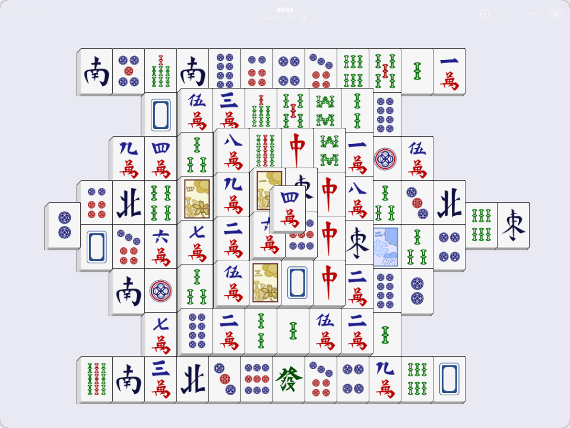

# gnome-mahjongg-rb

A Ruby GTK4 / Libadwaita port of [GNOME Mahjongg][upstream], the tile-matching
solitaire game. It is a port of upstream 49.1.1, not a rewrite: the same ten
layouts, the same three tile sets, the same save file, the same score file,
the same menus, dialogs and keyboard shortcuts.



## Playing

Clear the board by taking matching pairs of tiles off it. A tile can only be
picked up when nothing is stacked on top of it and at least one of its long
edges is free. Rounds are scored on completion time; hints cost 30 seconds and
reshuffling costs 60.

| | |
|---|---|
| <kbd>Ctrl</kbd>+<kbd>N</kbd> | New game |
| <kbd>Ctrl</kbd>+<kbd>R</kbd> | Restart the same board |
| <kbd>Esc</kbd> / <kbd>Ctrl</kbd>+<kbd>P</kbd> | Pause |
| <kbd>Ctrl</kbd>+<kbd>H</kbd> | Hint |
| <kbd>Ctrl</kbd>+<kbd>Z</kbd> | Undo |
| <kbd>Shift</kbd>+<kbd>Ctrl</kbd>+<kbd>Z</kbd> | Redo |
| <kbd>F1</kbd> | Game rules |

Double-clicking the background once nothing is blocked any more plays the rest
of the game out.

## Running it

```sh
direnv allow          # or: nix develop
rake schema locale    # GSettings schema, and the 93 message catalogues
./bin/gnome-mahjongg-rb
```

Or build and run the installed package, which wraps the launcher with the
schema, icons and data directory it needs:

```sh
nix run .
```

## Development

```sh
rake                  # schema, catalogues, metadata, tests, lint
rake test             # the two test scripts on their own
rake locale           # recompile po/*.po after a translation update
rake pot              # regenerate the template from po/POTFILES.in
rake lint             # rubocop, including the custom cops in cops/
```

The tests need no display: GTK4 renders offscreen, and `test/ui_test.rb`
drives the real window — playing moves through the board view, opening every
dialog, winning a game — and writes screenshots to `tmp/shots` as it goes.

| File | What it holds |
|---|---|
| `lib/mahjongg/map.rb` | The layout catalogue and its parser |
| `lib/mahjongg/game.rb` | Tiles, the board generator, the rules, the clock |
| `lib/mahjongg/game_view.rb` | Drawing the board and hit-testing it |
| `lib/mahjongg/window.rb` | Header bar, clock, the stack of two board views |
| `lib/mahjongg/application.rb` | Actions, settings, save file, score file |
| `lib/mahjongg/score_dialog.rb` | The scores column view |
| `data/` | Layouts, tile sets, CSS, GSettings schema, icons |
| `po/` | Upstream's 93 message catalogues, reused unchanged |

[PORTING.md](PORTING.md) covers how the Vala maps onto this, and
[FINDINGS.md](FINDINGS.md) records the ruby-gnome defects found on the way.

## Licence

GPL-2.0-or-later, as upstream. The layouts, tile sets and icons under `data/`
and `po/` are upstream's, unchanged apart from the tile-set wrappers described
in PORTING.md.

[upstream]: https://gitlab.gnome.org/GNOME/gnome-mahjongg
